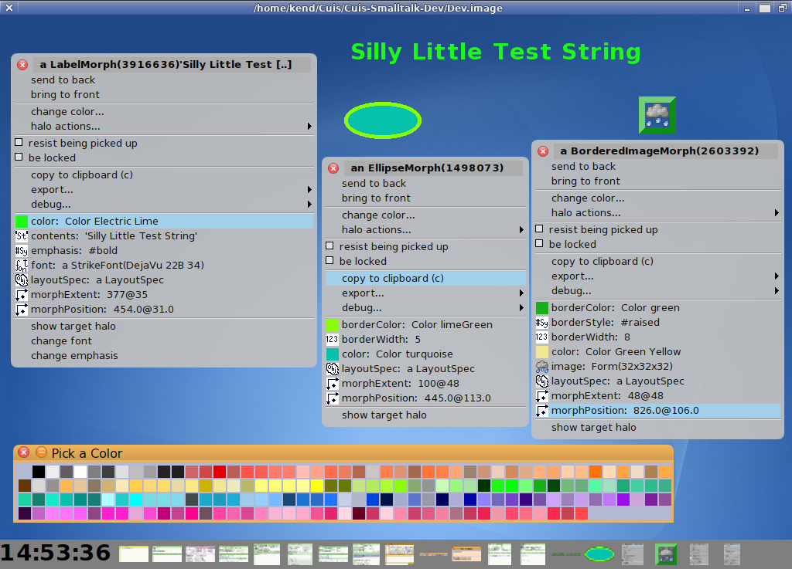

# Cuis-Smalltalk-MetaProperties
===============================
VisualProperty Access for Morphs

Tested in Cuis 3695.

This package adds ** visual property menu items ** to a Morph's edit menu (the menu available from a Morph's constuction halo).

Common graphical properties are presented for easy editing via drag 'n drop.

So you can open a ___visual properties menu___ and drag a color, font, position point, drop it on a visual property menu item and have the morph change.  You can also drag values ___from___ the menu.  So you can drag a color/font/position/border-width/image/.. from one Morph's visual property menu and drop it on another.

You can also click on visual menu item fields to get either a simple editor or pallet of choices for that property. 

If you open a ColorEditor, you can drop a color on its main color swatch to see that color's metrics and edit that color.  You can drag a color from the ColorEditor's color swatch and drop on a Color property in the Morph's visual properties editor.

Note that if a value is not a Morph, a ***SignMorph*** is created for the value so that you can drag and drop it.  You can inspect a SignMorph to see the contained object's value.



Tested in Cuis 5.0 revision 3695 -- Suggestions appreciated!

Requires packages from:
-  Cuis-Smalltalk-Morphic-Misc1
-  Cuis-Smalltalk-NamedColors
-  Cuis-Smalltalk-ColorEditor

Note also, the Cuis-Smalltalk-Babysteps MorphIt package!

More fonts available via (not required):
-  Cuis-Smalltalk-SF2-Import

````Smalltalk
	Feature require: #'Morph-MetaProperties'. "NB: NOT 'Morphic' "

	"Open morphs from World menu->New Morph.. submenus"
	ImagePallet namedColors.  "Click on a color and drop on a color property"
	(SignMorph forObject: 6) openInHand. "drop 6 on borderWidth property"
````

The basic usage is for annotating Morph subclasses for visual editing via DragNDrop.

This annotation is done by adding ***MetaProperties*** for the typical instance variables and properties.  MetaProperties are used to check what values an iVar #accepts:

This strategy allows for adding visual properties for editing to a Morph's class without change to the class code.  Visual properties are inherited, so the annotations for instance variables can be added once for a superclass.

For shared MetaProperty creation, see method MetaProperty class>>initializeDictionaries.

MetaProperties are immutable, so can be shared.  Many are predefined.  
````Smalltalk
(MetaProperty metaPropNamed: #acceptsColor) explore.
````

Annotating Morph Classes with MetaProperties is largely done in method #VisualPropertyEditor class>>initialize.  Note that you can require #'Morph-MetaProperties' in your own package(s) and add annotations for your own custom morphs.

MetaProperty instance creation examples (with test):
````Smalltalk
"Simple Class test"
(MetaProperty kind: String) accepts: #symbol.

"OneOf choice"
(MetaPropertyOneOf kind: Symbol choices: #(fee fie fo fum)) accepts: #fee.

"Number Range"
(MetaPropertyRange kind: Number minValue: 1 maxValue: 3) accepts: 1.2.

"Point Range"
(MetaPropertyRange kind: Point minValue: (0@0) maxValue: (4@4)) accepts: 1@3.

"Positive Point"
(MetaPropertyFrom kind: Point minValue: 0@0) accepts: 23@47.

"Pattern Match"
(MetaPropertyViaTest kind: String test: [ :s | '*baz*' match: s ]) accepts: 'mombazzi'.

````
