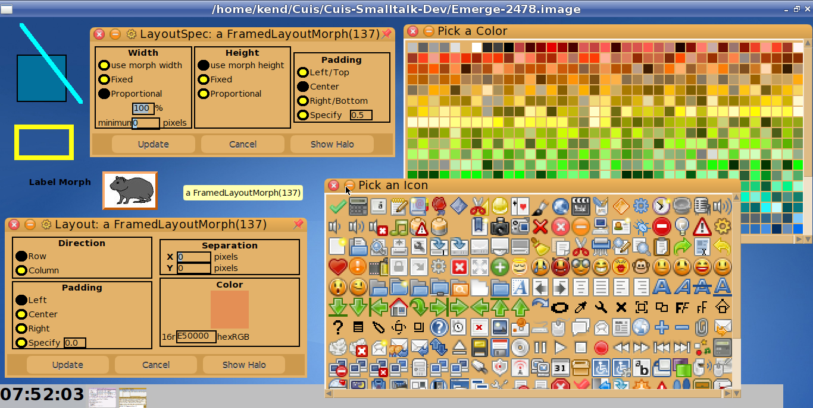

Morphic-Misc1
=============
Tested: Cuis 5.0 rev 3329

To load the package
 ````Smalltalk
	Feature require:  'Morphic-Misc1'.
````

Basic morphs used by various packages 
- AddedCursors
- BorderedImageMorph
- DropColorMorph
- DropTargetMorph
- EditPanel
- FontMorph used to display and select a font
- FrameMorph
- FramedLayoutMorph
- ImagePallet
- LabelMorph
- LayoutMorphEditPanel useful to edit Layouts
- LayoutSpecEditPanel useful to edit LayoutSpecs
- LineMorph
- PalletLayoutMorph
- Panel
- PluggableScrollBar
- RadioButtonMorph
- RadioGroup
- SignMorph useful morph to "point to" non-morph objects
- SimpleNumberEntryMorph
- WindowTitleMorph
 



After loading this package, one can select a morph (command-click), open its menu from the halo, and edit its LayoutSpec.
If the morph is a LayoutMorph, one can also open an editor for the LayoutMorph from the halo menu. 

You can also use a selected Morph's menu to show its Drop Target.  This lets one drag a color from the color pallet to set the Morph's color.  This is also used by some packages to add "drag n drop" behaviors to morphs (E.g the MorphIt package in Cuis-Smalltalk-BabySteps).

One package which requires this one is the Color Editor in https://github.com/KenDickey/Cuis-Smalltalk-ColorEditor

=======
